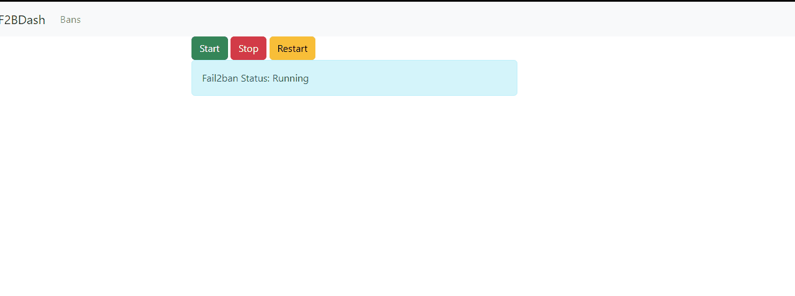

<!-- PROJECT SHIELDS -->
[![Contributors][contributors-shield]][contributors-url]
[![Forks][forks-shield]][forks-url]
[![Stargazers][stars-shield]][stars-url]
[![License][license-shield]][license-url]


<!-- TABLE OF CONTENTS -->
<details open="open">
  <summary><h2 style="display: inline-block">Table of Contents</h2></summary>
  <ol>
    <li>
      <a href="#about-the-project">About The Project</a>
      <ul>
        <li><a href="#languages-and-frameworks">Languages and Frameworks</a></li>
      </ul>
    </li>
    <li>
      <a href="#getting-started">Getting Started</a>
      <ul>
        <li><a href="#prerequisites">Prerequisites</a></li>
        <li><a href="#installation">Installation</a></li>
      </ul>
    </li>
    <li><a href="#usage">Usage</a></li>
    <li><a href="#roadmap">Roadmap</a></li>
    <li><a href="#contributing">Contributing</a></li>
    <li><a href="#license">License</a></li>
    <li><a href="#contact">Contact</a></li>
    <li><a href="#acknowledgements">Acknowledgements</a></li>
  </ol>
</details>


<!-- ABOUT THE PROJECT -->
## About The Project
fail2banDash is just as it sounds: a dashboard for fail2ban. This code can be used as a jumping-off point to add more functionality to it if you want.




### Languages and Frameworks

* Flask


<!-- GETTING STARTED -->
## Getting Started

### Installation

1. Clone the repo
   ```
   git clone https://github.com/AlbusNoir/fail2banDash.git
   ```
2. Create a virtual environment (if that's your thing, otherwise don't)
3. Install requirements
   ```
   pip install -r requirements.txt
   ```
4. Run app.py
   ```
   python app.py
   ```

If you have something else using port 5000 you'll need to edit app.py to use something else. Change the last line in app.py from ```app.run(host='0.0.0.0')``` to be ```app.run(host='0.0.0.0', port=<yourporthere>)```. If you're running this in production, change debug to False (same place, just one line up in app.py)


<!-- CONTRIBUTING -->
## Contributing

If you want to make contributions, feel free. I made this for my own limited use case, but I also have other variations that have the ability to edit configs etc, so it's perfectly possible, and if you make your own neat additions, feel free to share them:

1. Fork this fail2banDashsitory
2. Create your Branch(`git checkout -b <branch name>`)
3. Commit your Changes(`git commit -m 'I did some things'`)
4. Push to the Branch(`git push origin <project_name>/<location>`)
5. Open a Pull Request


<!-- LICENSE -->
## License

Distributed under the [GPLv3](LICENSE) License. See [`LICENSE INFO`](https://choosealicense.com/) for more information.


<!-- MARKDOWN LINKS & IMAGES -->
<!-- https://www.markdownguide.org/basic-syntax/#reference-style-links -->
[contributors-shield]: https://img.shields.io/github/contributors/AlbusNoir/fail2banDash.svg?style=for-the-badge
[contributors-url]: https://github.com/AlbusNoir/fail2banDash/graphs/contributors
[forks-shield]: https://img.shields.io/github/forks/AlbusNoir/fail2banDash.svg?style=for-the-badge
[forks-url]: https://github.com/AlbusNoir/fail2banDash/network/members
[stars-shield]: https://img.shields.io/github/stars/AlbusNoir/fail2banDash.svg?style=for-the-badge
[stars-url]: https://github.com/AlbusNoir/fail2banDash/stargazers
[license-shield]: https://img.shields.io/github/license/AlbusNoir/fail2banDash.svg?style=for-the-badge
[license-url]: https://github.com/AlbusNoir/fail2banDash/blob/master/LICENSE
[twitter-shield]: https://img.shields.io/badge/-twitter-Twitter?style=for-the-badge&logo=twitter&colorB=555
[twitter-url]: https://twitter.com/twitter_username
